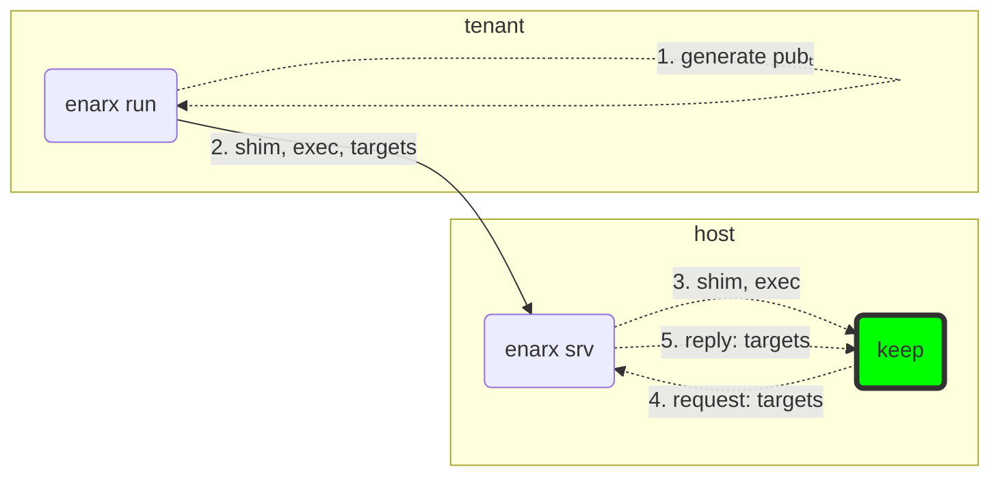
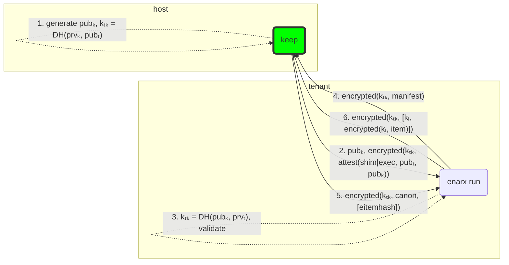
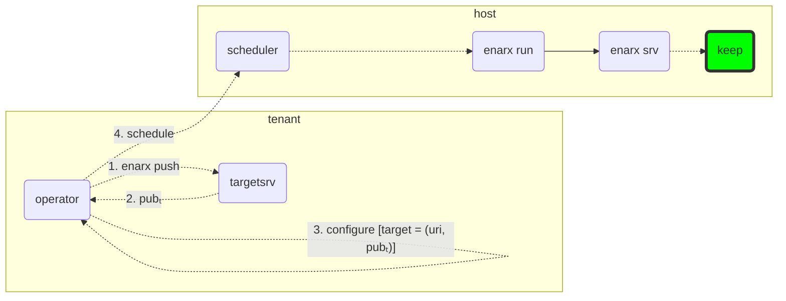
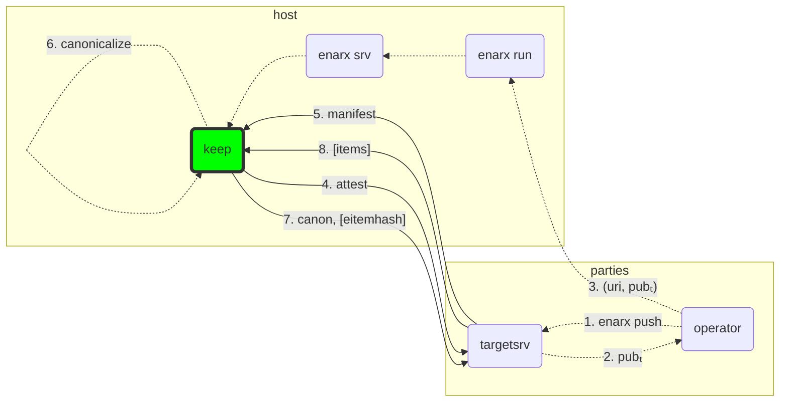
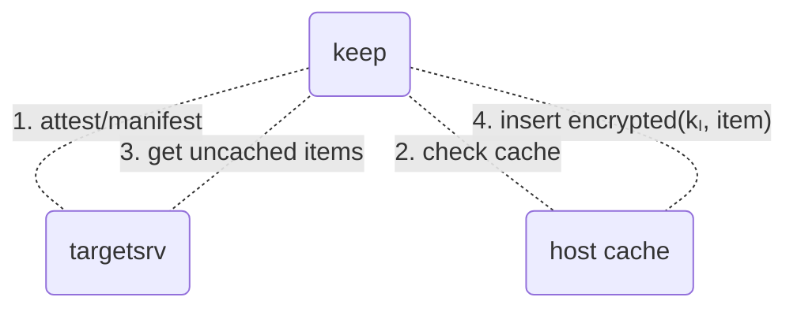

# Overview

This document describes the overall flow of the Enarx system. This document
contains numerous charts generated by [mermaid graph
generator](https://github.com/mermaid-js/mermaid). Viewing this document on
`GitHub` is substantially improved by [this browser
extension](https://github.com/BackMarket/github-mermaid-extension).

# Data Types

## Targets

The `targets` value is an ordered list (something like a `cbor` `array`) of
`target` configuration that will be passed to the keep. Each `target` contains two
parameters:

  1. A public key (`pubₜ`)
  2. A `url` indicating how to reach the target

### Target URL

The target `url` may contain one of two values:

  * `fd:` - the target is already connected on the *next* file descriptor
  * `tcp:host:port` - the target is listening using TCP on the specified host
    (ip address or hostname) and port

## Items

At various points in this document we will discus `items`. The term `item`
refers to a component that helps to make a finally assembled `keep`. This can
include the following:

1. a `wasm` module
2. a `wasm` module configuration
3. data (global or per-module)
4. assets (global or per-module)
5. secrets (global or per-module)

The precise definition of these is **TODO**.

# Deployment Models

Enarx intends to support multiple deployment models suited for different kinds
of tasks. In all of them, attestation is simply an implicit part of the
workflow and is handled implicitly. This document currently outlines the
following models:

1. Remote Push
2. Remote Pull
3. Multi-Party Compute
4. Provable Functions

## Model #1: Remote Push

Under the `Remote Push` model, we have a simple client (i.e. the `tenant`) and
server (i.e. the `host`). In this model the `host` is passive and spawns
execution when directed to by the `tenant`. It is important to outline that in
this model the `tenant` already has all necessary `items` to launch a keep,
including `wasm` code, `assets`, and `configuration`. A `keep` is brought up in
two phases:

1. Instantiation
2. Provisioning

### Phase #1: Instantiation

1. The `tenant` issues the `enarx run` command on the client system. This
immediately generates a target keypair (`pubₜ`, `prvₜ`).
2. The `tenant` `enarx run` process contacts the host (i.e. over `ssh`) and
connects to the `enarx srv` socket which activates the `enarx srv` process.
Then `enarx run` supplies the `shim` and `exec` layers to `enarx srv`, as well
as the `target`: `(pubₜ, "fd:")`.
3. The `enarx srv` process brings up a `keep` instance using the provided
`shim` and `exec`.
4. The `keep` issues a `target` request over `sallyport`.
5. The `enarx srv` process replies with the supplied `target`.

At this point the `keep` is ready to contact the `target`.

### Phase #2: Provisioning

1. The `keep` generates its instance keypair (`pubₖ`, `prvₖ`). This keypair
lives until the `keep` is fully provisioned. Further, it calculates a session
key `kₜₖ` using the target's `pubₜ`.
2. The `keep` sends its public key (`pubₖ`) as well as an attestation report
encrypted under `kₜₖ` to the target (in this case, the `tenant`). The
attestation report contains measurements of the `shim`/`exec`, the `target`
public key (`pubₜ`) and the `keep` public key (`pubₖ`).
3. When the `tenant` receives the previous message, it calculates the session
key (`kₜₖ`). Note that at this point we cannot be sure that the session key
(`kₜₖ`) actually corresponds to a `keep` on the other side. We solve this
problem by decrypting the provided attestation, validating it and ensuring that
`pubₖ` in the attestation matches the `pubₖ` we received outside of the
attestation. The `tenant` should also validate that the `shim`, `exec` and
`pubₜ` match expected values.
4. If attestation validation succeeds, the `tenant` will return a `manifest` of
the final `keep` contents. Note that this does not include the items
themselves, but merely a hash of item after encrypting the item contents under
`kₗ`. We will see why this is important in further discussion.
5. Once the `keep` has received the `manifest` from the `tenant`, it is
converted into canonical form (`canon`). In our current deployment model, the
`canon` is likely to be identical to the `manfiest`. This will be different in
the `Multi-Party Computation` model. Finally, the `keep` will request all
required items from the target by supplying the full `canon` along with an
array of the hash of each required item when encrypted under `kₗ`
(`eitemhash`).
6. Finally, the `tenant` returns the encrypted items as well as the keys used
to encrypt them (`kₗ`). Note that the `keep` **must** validate that the items
actually match the hash for the item in the `canon`. This is particularly
important for the `Multi-Party Computation` model.

## Model #2: Remote Pull

Under the `Remote Push` model we had simple operation. However, we made the
assumption that the `tenant` who wishes to deploy a workload is also the
`scheduler` of the `enarx run` process. This may not be the case. For example,
a `tenant` may wish to wrap `enarx run` in a container and execute it using
`kubernetes` as a `scheduler`. This requires we break our previous `tenant`
process into three distinct components:

1. the `operator` who wants to deploy a workload
2. the `scheduler` that will actually trigger the `enarx run` process (i.e.
`kubernetes`)
3. the `targetsrv` that will supply the `keep` with its `items`

We can achieve this using the same protocol as before, but by using a separate
`targetsrv` process and some additional steps during the `Instantiation Phase`.

### Phase #1: Instantiation

Instantiating a `keep` under the `Remote Pull` model is basically the same as
the `Remote Push` model, but with some additional steps at the beginning.

1. The `operator` issues the `enarx push` command to store a fully deployable
keep inside the `targetsrv`. The `targetsrv` receives the the following data:
measurement of all allowed `shim`, `exec` and `backend` combinations, the
`manifest` and all `items`.
2. Upon receipt of the aforementioned items, the `targetsrv` creates a new keep
instance record storing all the items and generates the target keypair (`pubₜ`,
`prvₜ`), returning the public key (`pubₜ`) to the `operator`. The `enarx push`
process returns an appropriate `target` configuration. This will likely have a
`uri` of `tcp:...` so that it can connect to the `targetsrv`.
3. The `operator` uses the `target` configuration to produce `targets` which it
associates with the job to run. For example, the operator might include the
`targets` in a `Dockerfile` and then build it with `docker build`.
4. The `operator` schedules the job to run. For example, this might include
configuring the aforementioned container to run under `kubernetes`.

All remaining steps are identical to the `Remote Push` model.

### Phase #2: Provisioning

The provisioning phase is identical to the `Remote Push` model, with the
exception that the `keep` will connect to the `targetsrv` instead of the `enarx
run` instance. This is because the `target` contains a different `uri`.
Further, the `targetsrv` will use the `pubₜ` key to uniquely identify which set
of `items` to deploy. Other than these differences, this process is identical
to the `Remote Push` model.

## Model #3: Multi-Party Computation

As an astute reader, you've probably noticed that we are passing `targets` into
the `keep` instantiation process but that this has, until now, only had a
single `target` configured. Under the multi-party computation model, we are
going to assembly a composite `keep` containing `items` from multiple different
parties. This model builds on the previous models by allowing the `keep` to
contact multiple `targetsrv` instances and merging each of their `manifest`s
into one canonical manifest (`canon`). Let's survey the whole process. Note
that all the details in this process are the same as previous models.
Therefore, we will elide many details to make it easier to reason about. This
does not imply these details are dropped under this model.

1. Each party in the computation uses an agreed upon `enarx` build. Each party
does an `enarx push` to store their `items` in their own `targetsrv`.
2. Storing `items` in a `targetsrv` produces a public key (`pubₜ`) which
references them.
3. Each party submits its `target` configuration which are combined into
`targets`. The `targets` input is supplied to the `enarx run` command, which
can be executed either manually or by a scheduler. A `keep` is instantiated
like normal.
4. The `keep` attests to each `targetsrv`.
5. Each `targetsrv` reports the manifest for all the items it is willing to
deploy.
6. The canonicalized manifest (`canon`) is produced by merging the `manifest`
from each `targetsrv`.
7. This step is where the magic happens. The `keep` requests the required
`items` from each `targetsrv`. As part of this request, it provides the `canon`
which circumscribes precisely how the final keep will be assembled, including
all the `items` from all the `targets`. Each `targetsrv` can evaluate the final
state of the `keep` before agreeing to supply its `items`.
8. If the `targetsrv` agrees that the `items` can be used to compose the
`canon`, the `items` will be released for use in the `keep`.

## Model #4: Provable Function

**TODO**

# Discussion

## Caching

This protocol theoretically allows for the caching of `items` on the host side.
The flow looks something like this:

The cache would contain only encrypted items, so we wouldn't leak plaintext.
Further, because we don't have `kₗ` and **must** fetch it from the `targetsrv`,
the `targetsrv` still has access control over its items.

However, a few downsides still remain.

1. Tracking. It would be possible to tract which keeps are executed where.
Further, if one could build a database of vulnerable `items` it would be
possible to identify keeps that run them based on the items they look for in
the cache.

2. Offline Brute Force. Anyone who gets access to the cache can attempt to
brute force decrypt the item offline. This could be particularly troubling if
there are vulnerabilities in the encryption algorithm either now or in the
future. Once we cache the items, we lose the perfect forward secrecy of the
encryption channel we've built.

To mitigate these downsides, the `targetsrv` supplied `manifest` should be able
to specify cache control directives. These can indicate, for example, whether
caching is allowed or not for a specific item.

## Item Bundling

Although not (yet?) outlined in this protocol, it should be possible to bundle
items with `enarx run`. In fact, bundling is just a species of caching where we
pre-inject items into the server-side cache.

## Validation of Targets

It might appear that no validation of the `targets` input is performed. This is
only partially true. While it is true that there is no validation of this input
before initial contact, each `target` does supply input to the `canon` which is
validated by all `targetsrv`s. Therefore, the only vulnerability that this
introduces is host-side denial of service which is outside our threat model.
