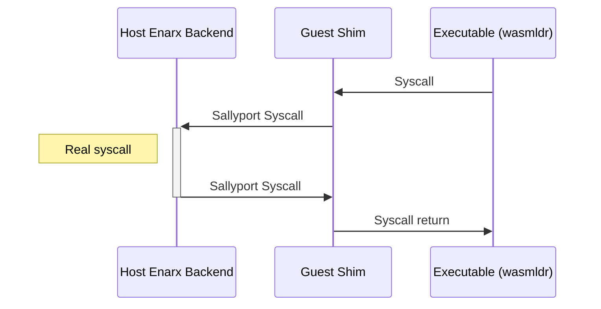
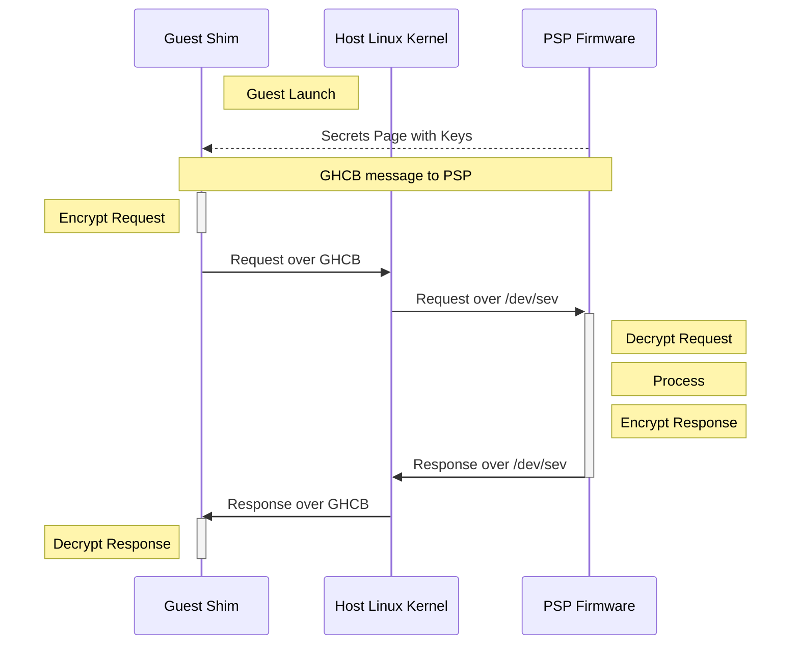

# Secure Encrypted Virtualization (SEV) - SNP

- SEV - Secure Encrypted Virtualization
- SEV-ES - Secure Encrypted Virtualization - Encrypted State
- SEV-SNP - Secure Encrypted Virtualization - Secure Nested Paging
- PSP - Platform Security Processor

## Launching

- create a normal VM, reserve memory
- special ioctls with /dev/sev to talk to the firmware of the PSP
- populate the memory with the shim and executable (exec-wasmtime) elf sections
- mark memory as encrypted
- 2 special pages marked in the elf sections
    - CPUID
    - SECRETS
- create a CPU
- start CPU with IP == reset vector
- 16 bit mode
- 32 bit mode with GDT with segments
- 64 bit mode with initial page tables
- 64 bit mode with final page tables
- jump to rust 🎉

## CPUID page
- contains all `cpuid` request return values
- pre-validated by firmware
- like size of `xsave` area
- like location of C-bit

## Secrets page
- private keys for communication with PSP SNP firmware
- OS free use
    - message numbers
    - AP jump tables

## Memory Layout

| Address    | Usage       | Size |
|------------|-------------|------|
|            | Sallyport   |      |
|            | GHCB        | page |
|            | Secrets     | page |
|            | CPUID       | page |
|            | PML3        | page |
|            | PML4        | page |
| 0xFFFFF000 | ResetVector | page |
|            | Shim        |      |
|            | Executable  |      |

The shim maps all memory to kernel address space starting with `0xFFFF_FF80_0000_0000`.

Every encrypted page has to have the encryption bit (C-Bit) set in the pagetables.

New memory, which the shim wants to accept from the host at runtime has to be marked
encrypted or unencrypted (shared) via the `pvalidate` opcode.

## Syscalls

## VMM Communication Exception (`#VC`)

Normally a `KVM` VM can be intercepted by the host on a lot of occurrences (linux/arch/x86/kvm/svm/svm.c#L991) like writing to registers, MSRs, issuing `cpuid`, etc.

With SEV-ES and SEV-SNP, the register contents is saved **encrypted** in the VMCB, when a #VMEXIT occurs. Additionally, for certain types of `#VMEXIT`
a new exception is thrown inside the guest called VMM Communication Exception (`#VC`).

The guest `#VC` handler is responsible for determining what register state is necessary to expose to the hypervisor for the purpose
of emulating this operation. The `#VC` handler also inspects the returned values from the hypervisor and updates the guest state if the output is deemed acceptable.

For now, the shim only handles the `cpuid` instruction in the `#VC`, but may intercept other `#VMEXIT` in the future.

For the `cpuid` instruction the shim uses the CPUID page, the shim got on startup, as a lookup table to return validated results.

## Communication with the SNP firmware

Simple commands like announcing the GHCB page or turning a single page into a shared page are done via the GHCB MSR.

More advanced communication happens via the GHCB.

AES-GCM with a 256-bit key and 96-bit nonce is used as the encryption algorithm to talk with the firmware.

## Attestation Report

An attestation report can be requested via a GHCB extended request. An extended request references additional shared (unencrypted) memory for data exchange.
The communication with the firmware exchanges only encrypted and signed data, so the host kernel cannot play man-in-the-middle even with that extra unencrypted memory.
64 byte of user data can be added to be included in the report.

The signed report can be verified by using the certificate chain available from https://kdsintf.amd.com/vcek/v1/Milan/cert_chain for the root keys and for the platform key,
from a URL constructed with some platform parameters.

You can call `enarx sev vcek` on the SEV-SNP machine, which will do all the magic and return the whole chain in a consumable format. Because the key server is rate limited,
you would do that once on bootup and use the cached result.
