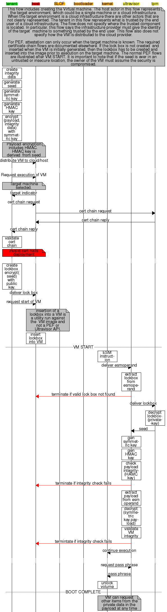

# Attestation Documentation

This directory contains information on attestation for the various
technologies involved. Technologies are listed in alphabetical order.

### Colors

In process diagrams, colors mean the following:

* Green: Implicitly Trusted
* Red: Untrusted
* Yellow: Trusted via a Cryptographic Root of Trust
* Orange: Trusted via Cryptographic Measurement

In certificate chain diagrams, colors mean the following:

* Blue: The private key is accessable only by hardware.

## AMD

### SEV

The AMD SEV attestation process is a series of cryptographic transactions between a tenant (entity that wants a
secure virtual machine) and a host (the entity that provides the virtual machine on their infrastructure).
This attestation process establishes the following:

* A guarantee that the tenant's secure virtual machine (the guest) is running on an authentic AMD processor which
  correctly implements AMD's Secure Encrypted Virtualization (SEV) technology in microcode. This demonstrates
  that the host's processor is capable of supporting an SEV-enabled guest and the guest can be assured it is
  receiving the protections advertised by the SEV featureset once attestation is complete.
* A guarantee that the platform that tenant's virtual machine will be running on is actually owned by the host.
* The host-provided virtual machine image matches exactly what the tenant is expecting. That is, both the tenant
  and the host calculate the same measurement of the image.
* A secure channel to inject a secret (or secrets) into the encrypted guest so that its workload is entirely
  private and known only to the guest itself.

AMD SEV seeks to provide these guarantees even with the presence of a potentially hostile or compromised host.

#### Establishing Trust

The public-key cryptography employed in the attestation for AMD SEV forms a tree-like structure that can be traced
all the way back to two roots of trust (an authoritative, completely trusted entity):

The above diagram illustrates the two roots of trust from which two chains of trust are established, each terminating
at the Platform Diffie-Hellman (PDH) node at the bottom. This relationship is important because it shows how trust
is traced back to what is known as a "root of trust", or in other words: a completely trusted, authoritative entity.
For AMD SEV, the roots of trust are Advanced Micro Devices (AMD) and the owner of the platform (the entity providing
the host or a group of hosts). A chain of trust is formed when a trusted entity uses its key to sign another entity's
key.  When an entity's key is signed by a trusted entity, then the newly-signed key is also trusted.

Let's step through the two chains of trust shown in the above diagram:

The first root of trust is the **Owner Certificate Authority (OCA) signing key**. The OCA is exclusively owned
by the owner of the platform (the entity that provides the host). It is used to sign the Platform Endorsement Key
(PEK) to indicate that the owner controls the platform. The only exception to this is if the platform is considered
"self-owned". In this case, the SEV firmware will generate both the public and private OCA keys and store them. The
"self-owned" state is the default state.

The second root of trust is the **AMD Root Key (ARK)**. The ARK is used to sign the AMD SEV Signing Key (ASK) to mark
it as an authentic AMD key in the chain of trust. The ARK is an offline key, carefully protected and controlled by
AMD. This key is used to sign the AMD Signing Key (ASK), which is online.

The **AMD SEV Signing Key (ASK)** is signed by the ARK and is therefore branded as an authentic and trusted AMD key.
This key is used to sign the Chip Endorsement Key (CEK).

The **Chip Endorsement Key (CEK)** is a unique key stored within the fuses of the chip itself. This key is signed by
the ASK to officially associate the processor with the AMD chain of trust. The ASK's signature indicates that the chip
is an authentic AMD processor. This key is signed during provisioning, a process by which a platform owner takes
control over the platform. The platform owner exports this key, submits a POST request to an online service, and
AMD returns the key with an ASK signature on it.

The two chains of trust intersect at the **Platform Endorsement Key (PEK)** which is signed by both the OCA and the
CEK. This means that the PEK derives trust from both roots of trust: AMD and the platform owner. Any key signed by
the PEK is considered to be trusted by both the platform owner and AMD. This key is generated by the SEV firmware
(the software that controls the Platform Secure Processor).

Finally, the chain of trust terminates at the aforementioned **Platform Diffie-Hellman (PDH)** key. This key is used
to enable a key exchange between the PSP firmware and the tenant to create a master key.

#### Attestation Overview

1. **Validation:** Tenant will validate the certificate chain (described above) provided by the host.

1. **Secure Channel Establishment:** Tenant and Platform Secure Processor (PSP) will negotiate an encrypted channel.

1. **Measurement:** Tenant will validate the measurement of the VM provided by the PSP.

1. **Launch:** Attestation is successful. The tenant will inject secrets into the guest and the guest is launched.

#### Performing Attestation

Now let's examine how the keys are used in practice to perform attestation and safely establish the guarantees that
were described earlier in the document with a tenant.

First, have a quick look at the following diagram, then we'll unpack it:

##### Validation

1. To begin, the tenant will ask the host for the certificate chain. The host will route this request to the PSP which
   will export the certificate chain. The certificate chain is the chain of trust that can be traced all the way to
   the two roots of trust described above. The PSP's response contains the certificate chain and the firmware version
   that drives the PSP. The host will relay this response to the tenant.

1. The tenant will verify the certificate chain. The components of the AMD signing keys can be obtained individually
   to confirm the authenticity of the signatures on the certificate. Similarly, the owner's signature on the PEK
   derived from the OCA can be used to verify that the expected owner is in control of the platform.

1. The tenant will verify the firmware version advertised by the PSP. Some SEV features are only available in certain
   firmware revisions.

1. The tenant will build an execution policy. The execution policy contains configuration information. For example:
   requiring SEV-ES support, disabling the ability to transmit the guest to another platform, or a minimum firmware
   version. This policy will be delivered to the PSP in a secure channel, which will be established next.

##### Secure Channel Establishment

1. The tenant will create a trusted channel between itself and the PSP to facilitate attestation:

   1. The tenant generates a random Transport Integrity Key ("tik") and random Transport Encryption Key ("tek").

   1. The tenant already has the host's Platform Diffie-Hellman (PDH) key from the certificate chain it requested.

   1. The tenant generates its own random Elliptic Curve Diffie-Hellman (ECDH) key pair.

   1. The tenant derives a shared secret ("Z") from its own PDH and the host's PDH.

   1. The tenant generates a random nonce ("N").

   1. The tenant generates a random initialization vector ("IV").

   1. The tenant derives the master key ("M") from the shared secret ("Z") and the nonce ("N") and from the string
      "sev-master-secret".

   1. The tenant derives a Key Encryption Key ("kek") from the master key and the string "sev-kek".
   
   1. The tenant derives a Key Integrity Key ("kik") from the master key and the string "sev-kik".

   1. The tenant concatenates the Transport Encryption Key ("tek") and the Transport Integrity Key ("tik") and wraps
      the result with the Key Encryption Key ("kek"), which is then wrapped by the Key Integrity Key ("kik").

   1. The Key Integrity Key ("kik") is used to hash and sign the wrapped data with HMAC-SHA256, seeded from the
      initialization vector ("IV").

   1. The Transport Integrity Key ("tik") is used to hash and sign (HMAC-SHA256) the guest's execution policy that
      was crafted above.

1. Finally, the tenant has prepared everything that is required to establish a secure channel between itself
   and the PSP. The tenant will transmit the following to the host (which will relay it to the PSP): the
   tenant's PDH public key, the TIK-protected policy, KIK-protected KEK (TEK, TIK), the nonce ("N"), the
   initialization vector ("IV").  This is everything the PSP needs to securely derive its own understanding
   of the shared secret and decrypt the buffers. This initiates attestation and foreshadows a virtual machine
   launch.

   | transmitted as | component |
   | --------------: | - |
   | plaintext | N, IV, tenant's PDH (public key) |
   | ciphertext | (KEK: TEK\|TIK) |
   | integrity-protected | (TIK: guest policy), (KIK: KEK) |

1. The PSP will receive the tenant's request for a secure channel and decrypt it.

   1. The PSP will use the nonce ("N"), its PDH and the tenant's PDH to derive the shared secret ("Z") that the
      tenant had derived.

   1. The PSP will derive the master secret ("M") using the shared secret it had just derived.

   1. The PSP will derive the Key Encryption Key ("kek") and the Key Integrity Key ("kik") from the master
      key ("M").

   1. The PSP will decrypt the KIK-protected buffer sent by the tenant which contains the KEK (which itself wraps
      around the concatenated TEK and TIK data).

   1. The PSP will decrypt the KEK-wrapped buffer to reveal the TEK/TIK concatenated buffer.

##### Measurement

1. The PSP will create an SEV context for the tenant's virtual machine (guest) and begin bootstrapping an encrypted
   environment for the it.

   1. The PSP will use the TIK to decrypt the policy and associate the policy with the guest for the entirety
      of its lifetime.

   1. The PSP will create a cryptographic measurement of the pages provided by the host.

   1. The PSP will encrypt the guest's pages.

   1. The PSP will use the TIK to hash and sign the measurement it took of the pages prior to encryption and
      send this reply to the host which then routes it to the tenant.

   | transmitted as | component |
   | --------------: | - |
   | integrity-protected | (TIK: measurement) |

1. The tenant will digest the response from the PSP containing the measurement of the virtual machine image.

1. The tenant will perform its own measurement of the pages. If it calculates the same measurement, then the image is
   exactly what the tenant was expecting. If not, attestation has failed, and the tenant should assume the image has
   been tampered with.

##### Launch

1. If the tenant agrees with the PSP's measurement of the pages, the guest is now ready to securely receive any
   secret metadata.

   1. The tenant will generate a new initialization vector ("IV") to seed AES-128 encryption used to protect
      the transmission of the secret.

   1. The secret will be encrypted with AES 128 using the TEK to calculate the ciphertext.

   1. The secret ciphertext will be hashed and signed by the TIK with HMAC-SHA256.

1. The tenant will send the encrypted metadata (secret) to the host which will then relay it to the PSP.

   | transmitted as | component |
   | --------------: | - |
   | ciphertext | (TEK: secret metadata)  |
   | integrity-protected | (TIK: TEK) |

1. The PSP will decrypt the ciphertext containing the secret and place it into the guest's memory.

1. Finally, attestation has successfully concluded and the virtual machine's launch is complete. The virtual
   machine is now ready to run under the protection of AMD SEV.

Please note that attestation for SEV-ES and SEV-SNP will be documented at a later date.

#### References

This document relies on a number of resources to accurately summarize the deeply technical process of attestation.
Please note that **this document will defer to AMD's official documentation if any component here is found to be in
disagreement with the AMD SEV's documentation.** If a discrepency is found, please reach out to file an issue and/or
open a pull request to notify the Enarx team. Your assistance is sincerely appreciated.

* [AMD Secure Encrypted Virtualization (SEV) API, revision 0.22](https://developer.amd.com/wp-content/resources/55766.PDF)
* [Enarx AMD SEV Technical Demonstration](https://github.com/enarx/demo/tree/master/amd-sev)

## IBM

### PEF

## Intel

### SGX

TBD
