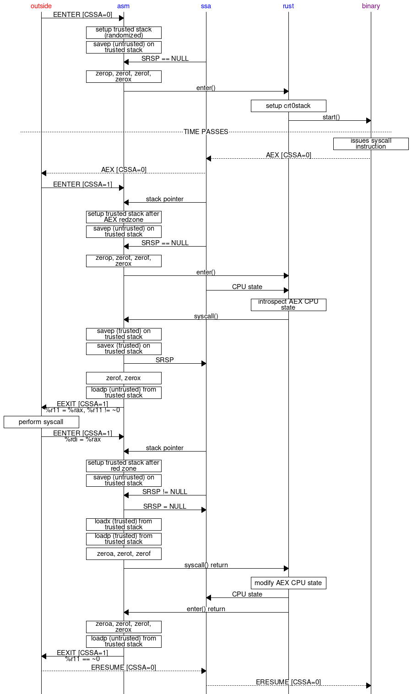

This documentation covers the architecture of the SGX keep.

### Syscall Proxy Process Flow

This diagram shows the flow of calls between `enarx-keep-sgx` (red,
untrusted) and the binary payload (purple, trusted) through
`enarx-keep-sgx-shim` (blue, trusted). The summary of the story is that
when the binary issues the syscall instruction, SGX performs an
asynchronous exit (AEX). This is handled by `enarx-keep-sgx-shim` and
the syscall is proxied to the host. The results are returned to the
binary by modifying the AEX state save area before resuming execution.

### Trusted Stack Layout

This table contains the stack layout of the critical code.

As you can see, when entering the enclave the outside world's
callee-saved registers are saved for later restoration. The `ctx`
pointer is then created to record where on the stack these saved values
can be found. Then, when `syscall()` is called, we first save the
enclave's callee-saved registers before saving the `SRSP` to the state
save area for later retrieval. Then we use the `ctx` to load the
untrusted callee-saved registers before returning to the outside.

When returning from a syscall proxy, the entry code restores `stk` and
overwrites the untrusted callee-saved registers (from the top of the
stack to `ctx`). Then the `SRSP` is restored and the trusted
callee-saved registers are loaded. After this, the `ret` instruction
implicitly pops off the %rip value and jumps to it, returning to the
call site of the `syscall()`.

| Value | Note; stk points here                |
|-------|--------------------------------------|
| 0     | Alignment (8 bytes)                  |
| %rsp  | Untrusted                            |
| %rbx  | Untrusted                            |
| %rbp  | Untrusted                            |
| %r12  | Untrusted                            |
| %r13  | Untrusted                            |
| %r14  | Untrusted                            |
| %r15  | Untrusted; ctx points here           |
| ctx   | parameter for enter()                |
| aex   | &aex[CSSA-1]; parameter for enter()  |
| ...   | Between entry() and syscall()        |
| %rip  | Upon syscall() entry; return address |
| %rbx  | Trusted                              |
| %rbp  | Trusted                              |
| %r12  | Trusted                              |
| %r13  | Trusted                              |
| %r14  | Trusted                              |
| %r15  | Trusted; SRSP points here            |
